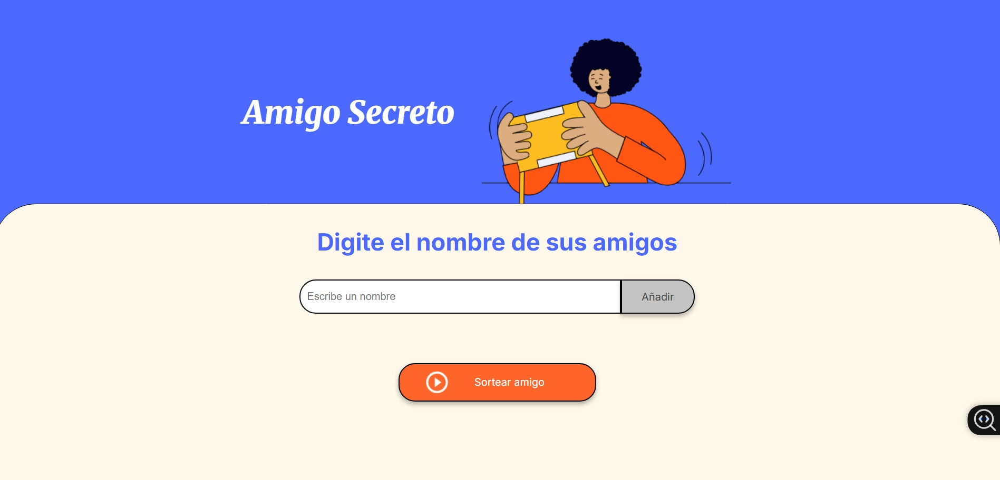

# Amigo Secreto

¡Una divertida y sencilla aplicación web para organizar sorteos de **Amigo Secreto** de forma rápida y sin complicaciones!

---

##  Vista previa


Accede a la aplicación en vivo en:  
**https://giullianomartinez.github.io/desafio-amigo-secreto/**  

La interfaz te permite ingresar nombres, agregarlos a una lista y realizar el sorteo con solo un clic.

---

##  Descripción del proyecto

Esta app, creada con **HTML**, **CSS** y **JavaScript**, permite a los usuarios:

- Ingresar nombres en un campo de texto.
- Agregar esos nombres a una lista visible.
- Realizar un sorteo aleatorio para elegir al “Amigo Secreto” con un solo botón.

Ideal para compartir en reuniones familiares, entre amigos o en el equipo de trabajo.

---

##  Cómo usarlo localmente

Para probar o desarrollar en tu equipo:

1. Clona o descarga este repositorio:
   ```bash
   git clone https://github.com/giullianomartinez/desafio-amigo-secreto.git

2. Entra al directorio:
   ```bash
   cd desafio-amigo-secreto


3. Abre el archivo index.html en tu navegador (Firefox, Chrome, Safari o similares).

4. ¡Listo! Comienza a agregar nombres y sortear tu Amigo Secreto.

## Funcionalidades

Agregar nombres: escribe un nombre y haz clic en "Añadir".

Mostrar lista: verás una lista dinámica con todos los nombres ingresados.

Sorteo aleatorio: haz clic en el botón "Sortear amigo" para revelar el nombre ganador.

Validaciones básicas: no se permiten entradas vacías ni duplicados (si lo implementas).

## 👨‍💻 Sobre el creador

Proyecto desarrollado por Giulliano Martínez

Más proyectos en: **https://github.com/giullianomartinez**
